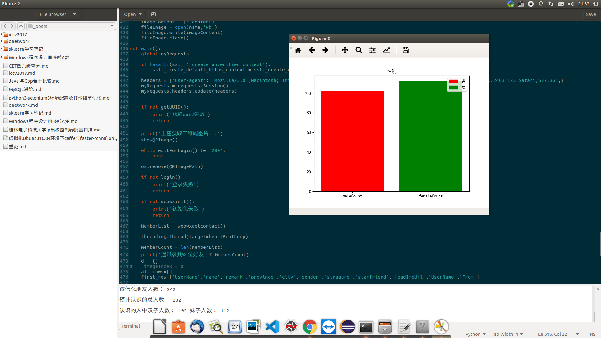
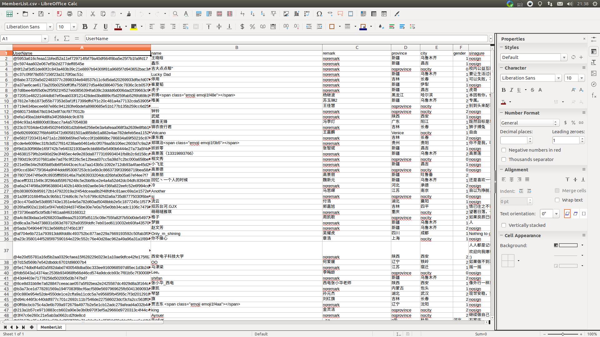
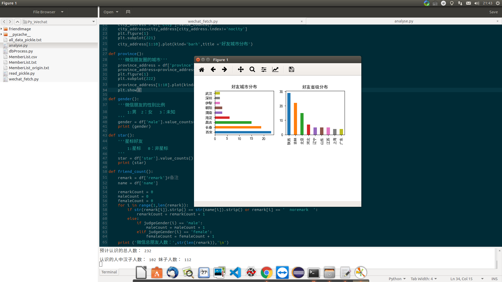

# crawerSet
本人未曾利用任何爬虫进行非法行为，因此用户对本程序的使用负责．

## chromeDriver安装

https://googlechromelabs.github.io/chrome-for-testing/
```
unzip chromedriver-mac-arm64.zip
sudo mv chromedriver-mac-arm64/chromedriver /usr/local/bin/
```
## 若提示xx package not found google安装即可

## 逐步脱敏并开源以前自己写的部分爬虫
在业余时间逐步脱敏并开源自己以前写的部分爬虫，主要是为了同大家交流学习，增长技术．他人在下载，传播，使用等过程中产生的任何非法行为，一律与本人无关．
因为部分爬虫都是17年以前写的，现在可能需要做部分修改才可运行，交流学习主体逻辑，功能即可．
<br>持续更新～～～
## 爬虫列表

### 1.晨午检

简介:自动填写某高校疫情期间强制学生填写的健康信息．<br>
使用说明:<br>
1.config.py中配置password_id_set=[("学号1","密码1"),("学号2","密码2")] 可以支持多人<br>
2.运行python main.py，如需要定时运行，参考３的设置<br>
2.配置contrab如下，每天每隔两小时自动提交<br>
运行crontab -e<br>
文件最后追加如内容

```
* */2 * * *  你的python路径　运行的文件路径　(可选　> 保存日志的路径)
实例:* */2 * * * /home/x/anaconda3/bin/python　/home/x/source/python/crawer/晨午检/main.py > home/x/source/python/crawer/晨午检／log
```

## 2.baidu_tel_mail
简介: 帮同学写的自动汇总百度搜索中搜索关键词页面的电话与邮箱．<br>
使用说明:<br>
1.config.py中修改配置信息<br>
2.python main_crawer.py<br>


### 3.zhibo8
简介: 世界杯期间，帮同学汇总球赛赛事，为喜欢的球队加油．<br>
使用说明:<br>
1.python zhibo8.py<br>
2.自动生成的保存在(日期.xlsx)位置<br>

### 4.iccv2017muti
简介：iccv2017的文章下载，实际可以用于cvpr以及其他年份，做简单修改．<br>
具体介绍可以参考[iccv2017文章批量下载https://xixiu.github.io/2017/11/18/iccv2017/](https://xixiu.github.io/2017/11/18/iccv2017/)<br>
使用说明：<br>
运行　python iccv2017muti.py即可<br>
单线程版本见说明<br>

### 5.zhihu
简介：zhihu话题答案批量爬取，并存储到数据库．<br>
使用说明：<br> 
1.zhihu.py　修改第197行，填写需要爬取的话题链接<br>
2.dbProcess.py　参考22-34插入字段，新建三张表，之后修改10-17行数据库信息．<br>
3.运行　python zhihu.com<br>

### 6.ICCV2018
简介:对应上面的iccv2017muti，简单修改即可爬取ICCV2018．<br>
详细请参考[iccv2017文章批量下载](https://xixiu.github.io/2017/11/18/iccv2017/)

### 7.icourse163
简介：抓取icourse163上特定的课程评论，做简单的自然语言处理．<br>
使用说明：<br>
1.将自己需要爬取的链接Ｆ12找到类似icourse163.py 43行形式的链接，填入对应的位置．
2.直接食用<br>


### 8.chictorpia
简介：抓取http://www.chictopia.com高质量服装图<br>
使用说明：<br>
1.python chictopia.py直接运行即可，即可将对应的图片保存在Img路径下

### 9.洋葱乐购ycmall
简介:洋葱点商平台下单脚本<br>
使用说明：<br>
1.74行设置帐号密码<br>
2.微信端发送消息，后台自动提交

### 10.UnClassify/Hbue.py
简介:湖北移动积分兑换脚本<br>

### 11.guet_win32
简介:桂林电子科技大学ip出校控制器破解，13年写的，不知道现在该校还有没有这个东西．<br>
使用说明：<br>
1.功能逻辑：通过win32gui暴力点击出校器，获取批量帐号<br>
2.使用前需要安装好win32<br>
3.准备好破解字典<br>
4.详细参考[python登陆桂林电子科技大学ip出校控制器](https://xixiu.github.io/2019/07/04/%E6%A1%82%E6%9E%97%E7%94%B5%E5%AD%90%E7%A7%91%E6%8A%80%E5%A4%A7%E5%AD%A6ip%E5%87%BA%E6%A0%A1%E6%8E%A7%E5%88%B6%E5%99%A8%E6%89%B9%E9%87%8F%E6%89%AB%E6%8F%8F/)

### 12.Py_Wechat
简介:python微信好友分析．<br>
使用说明：<br>
1.安装mysql,并建表<br>
2.运行wechat_fetch.py<br>
3.会自动进行男女＼城市等分析，并吧好友头像下载到friendImage文件夹．效果<br>
男女分布

详细信息

城市分布


### 13.QQ_ZONE
简介:基于qq空间的社交网络分析<br>
说明：
1.安装数据库<br>
2.程序只爬取了二代好友关系，可以爬取需要的好友关系，之后用数据尽情分析吧<br>
3.详细参考[400w好友社交网络验证](https://xixiu.github.io/2017/10/04/qnetwork/)<br>
3.效果图<br>
所有二代好友关系


### 14.osta
简介:国家资格证书查询定时任务<br>
说明：
1.依赖项<br>
```cmd
python3 -m pip install opencv-python
```

2.配置姓名、身份证号<br>
```cmd
# 三个参数任意配置2个
# 姓名
export MY_NAME=""

# 身份证号
export MY_CARD_NO=""

# 证书编号
export OSTA_CERTIFICATE_NO = ""
```

3.配置自动查询<br>
